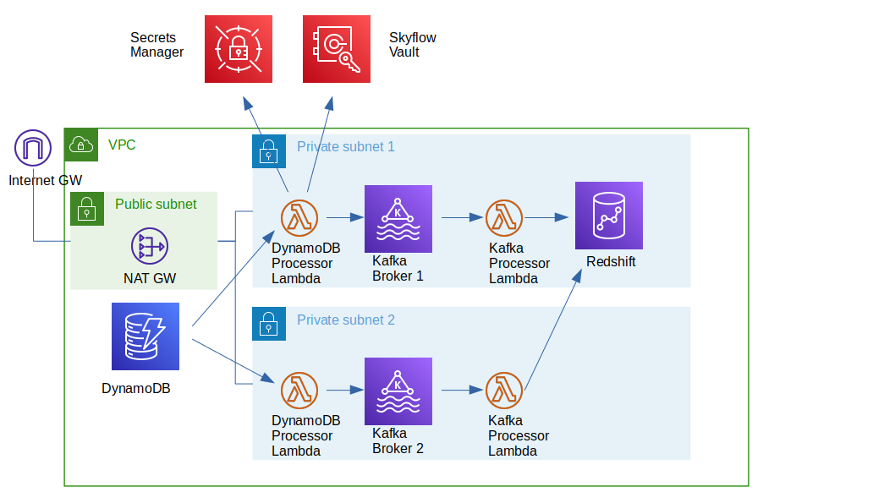
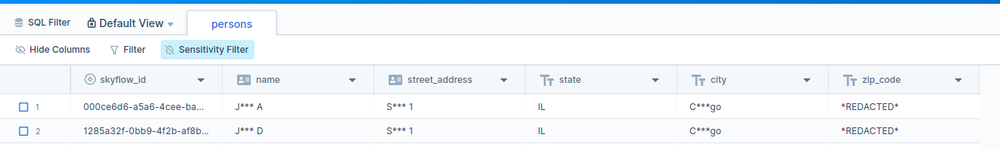

# AWS Analytics Pipeline Sample Application

This sample application provides a template that demonstrates how to integrate Skyflow's vault API with a data ingestion platform hosted on AWS. You can use a similar approach to preserve privacy while ingesting data in your own analytics pipeline.

The project consists of an AWS CloudFormation template, and 2 serverless AWS Lambda projects.

The CloudFormation template creates the basic infra structure in AWS, with a VPC, 1 public subnet, 2 private subnets, 2 Kafka brokers, 1 Redshift single node cluster, a DynamoDB table and the network-relevant security groups.

The 2 serverless Lambda projects contain Lambda functions to process the data. The first project gets notified when data is added to DynamoDB, then it persists this data to Skyflow's vault and then pushes the tokenized version to a topic in Kafka. The second Lambda project receives the data from Kafka and persists it to Redshift.



The rest of this README describes how to set up and test this sample application.

## AWS CloudFormation

**1.** In the AWS CloudFormation UI, choose **Create a new stack (with new resources)**.

Enter a name for your stack and fill in the following parameters:

- EnvironmentName: Name of the environment that will be used in naming the resources (such as VPC subnets etc.)

- DynamoDBTableName: A name for the DynamoDB table that will hold the data and trigger the Lambda functions when data is added.

- KafkaClusterName: Name to be used as resource name for the Kafka cluster.

- RedshiftClusterName: Resource name for the Redshift cluster.

- RedshiftDBName: Name of the default database created in Redshift.

- RedshiftAdminUsername: Name of the admin user name for Redshift.

- RedshiftPassword: Master password for Redshift admin user.

Wait for a few minutes while all of the resources are created.

Take note of the following, you will need this information later:
- Kafka endpoints
- Kafka cluster ARN
- Redshift cluster endpoint
- Private subnets id's
- DynamoDB table stream ARN (in the console go to the DynamoDB table -> exports and stream tab, and get the stream ARN from the DynamoDB stream details box)
- KafkaClient security group id (`KafkaClientSG`)
- RedshiftClient security group id (`RedshiftClientSG`)

**2.** Create Redshift table: In the console, choose the Redshift cluster that was created, and use the query editing tool. After connecting to the cluster, run the following script to create a table:
```
create table persons (
  skyflow_id VARCHAR(256) NOT NULL,
  name VARCHAR(256) NOT NULL,
  street_address VARCHAR(256) NOT NULL,
  state VARCHAR(256) NOT NULL,
  city VARCHAR(256) NOT NULL,
  zip_code VARCHAR(256) NOT NULL,
  CONSTRAINT pk_persons PRIMARY KEY (skyflow_id)
);
```

## Create a Skyflow Data Privacy Vault

Create a Skyflow vault with the following table name and schema so you can run this sample code. If you need a different structure, adjust the sample code accordingly.




## Set Up the Lambda Functions

First, make sure that you have a serverless framework installed, since both Lambda projects are based on it for packaging and deployment.
```
npm install -g serverless
```
For the Lambda functions to work, you'll also need to install and configure the AWS CLI with credentials and options.

### DynamoDB Processor Lambda

Go to the `dynamodb-processor-lambda` folder and install the dependencies.
```
npm i
```

Edit the `serverless.yml` file and replace the variables according to the resources generated by the CloudFormation script. The security group id, has to be the one for the KafkaClientSG security group, and the subnet id's the ones of the private subnets.

Replace the ARNs in the event configuration and policies in the `serverless.yaml` file with the ARNs of the resources generated by the CloudFormation script. Also, set the name of the topic in the environment variables, this is the topic where the data will be pushed to. 

Example:
```
events:
    - stream: arn:aws:dynamodb:us-east-2:XXXXXXXX:table/analytics-test-table/stream/2021-11-12T13:33:32.698
 
 ...
 ...

- Effect: Allow
  Action:
    - kafka-cluster:*Topic*
    - kafka-cluster:WriteData
    - kafka-cluster:ReadData
  Resource:
    - arn:aws:kafka:us-east-2:XXXXXXXX:topic/kafka-test-cluster/*
```

Next, set the vault URI environment variable, coupled with the secret manager secret name and the key where the vault credentials are stored, as follows:
```
environment:
    SECRET_NAME: <Secrets manager secret name>
    SECRET_KEY: <Key inside the secret where the credentials were stored>
    VAULT_URI: <URI of the vault>
    KAFKA_BROKERS: <List separated by ';' of Kafka brokers end point, with port number i.e xxx.kafa1.aws:9092;xxx.kafa2.aws:9092>
    TOPIC_NAME: <Name of the topic where data will be pushed>

```

After the variables are set, use the deploy command to build, upload the code, and create a stack for the Lambda function.
```
serverless deploy --stage dev
```

The stage option is optional and helps organize the stacks (the parameter go in the naming).

Once the Lambdas are deployed, go to the functions list in the console and look for the `dynamodb-stream-envname-topic-creator` function, and trigger it manually. It's just a convenience function to create the topic in Kafka, without the need of further configurations.

Now, the DynamoDB stream processing should be ready.

### Kafka Processor Lambda

The second Lambda function gets data from the topic and persists it to Redshift.

The setup method is similar to the DynamoDB processor function. First go to the `kafka-processor-lambda` folder and run 'npm i', as in the first case, to install the node dependencies.

Create a Redshift credential entry in the Secrets Manager and use the name to set the `SECRET_NAME` environment variable.

Then edit the `serverless.yml` file with the relevant values, as follows:
```
environment:
    SECRET_NAME: <Redshift credential name in Secrets Manager>
    DB_NAME: dev

...
...

functions:
    vpc:
      securityGroupIds:
        - <Security group id for RedshiftClientSG>
        - <Security group id for KafkaClientSG>
      subnetIds:
        - Private subnet 1 Id
        - Private subnet 2 Id
```

After the names are set up, deploy the Lambda:
```
serverless deploy --stage dev
```

## Test the Pipeline

To test if the stream is working and data is being pushed, go to the DynamoDB section in AWS (or create your own application if you prefer), and add an item with the following structure:

```json
{
    "name": { "S": "John Doe A" },
    "city": { "S": "Chicago" },
    "state": { "S": "IL" },
    "street_address": { "S": "Street 1" },
    "zip_code": { "S": "12345" }
}

```

Verify that the data is persisted in the vault, and the tokenized version is stored in Redshift.
